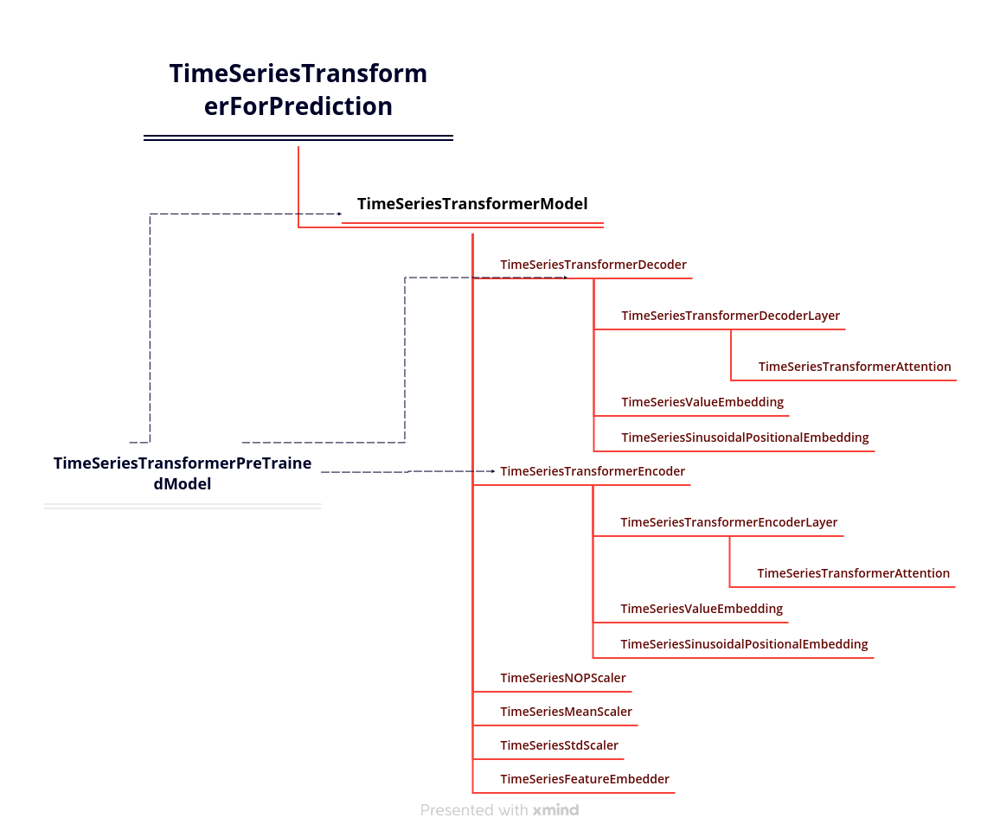

# Huggingface time series transformer model代码精读

网上关于time series transformer的资料较少，此项目以代码注释的形式记录了本人学习transformer时间序列预测过程中对Hugging face time series transformer model源码的逐行精读和学习过程，可作为他人相关学习的参考。其中中文部分注释为新增注释，英文注释为官方注释。

##模型官网文档
https://huggingface.co/docs/transformers/model_doc/time_series_transformer

##模型源码文档
https://github.com/huggingface/transformers/blob/main/src/transformers/models/time_series_transformer/modeling_time_series_transformer.py

##类依赖关系
红色表示依赖关系
虚线为继承关系

